# Bookia Store App

---

## Overview
Bookia Store App is a modern e-commerce mobile application developed using **Flutter** and **Dart**. It allows users to browse, search, and purchase books effortlessly. The app is designed to provide a seamless shopping experience, offering features like best sellers, new arrivals, wishlists, cart management, and order tracking. Users can also manage their profile, update information, and secure their account.

---

## Features & Functionality

### 📱 Authentication
- **Register:** Users can create a new account.
- **Login:** Secure login functionality.
- **Logout:** Users can safely log out of the app.
- **Reset Password:** Users can update their password easily.

### 🏠 Main Screens
The app's main interface is organized with a **Bottom Navigation Bar** including:
1. **Home**
   - **Carousel Slider:** Displays featured books or promotions.
   - **Best Sellers:** Showcase the most popular books.
   - **New Arrivals:** Highlight the latest books.
   - **All Products:** Browse the full catalog.
   - **Search:** Quickly find any book by name or category.
2. **Wishlist**
   - View and manage all the books added to the wishlist.
3. **Cart**
   - View all selected items.
   - Checkout button to place orders.
4. **Profile**
   - **My Orders:** Track previous and current orders.
   - **Edit Profile:** Update personal information.
   - **Reset Password:** Change password for account security.
   - **Settings:** Customize app preferences.
   - **Logout:** Exit the account securely.

---

## Project Structure

- **Splash Screen:** Initial loading screen of the app.
- **Welcome Screen:** App introduction and navigation to login/register.
- **Authentication Screens:** Register, Login, Reset Password.
- **Main Screen:** Contains Home, Wishlist, Cart, and Profile sections.
- **Home Screen:** Carousels, book listings (best sellers, new arrivals, all products), and search functionality.
- **Wishlist Screen:** List of user’s favorite books.
- **Cart Screen:** List of selected books and checkout option.
- **Profile Screen:** Account management including orders, profile editing, password reset, settings, and logout.

---

## Future Improvements
- Add **payment gateway** integration.
- Enable **push notifications** for new arrivals and offers.
- Implement **user reviews and ratings** for books.
- Support **multi-language** and **dark mode** themes.

---
## 📸 Screenshots
_All app screens showcasing the complete user journey_

---

### 🚀 App Launch
<table align="center">
  <tr>
    <td align="center">
      <b>Splash</b> 
      
    </td>
    <td align="center">
      <b>Welcome</b> 
      
    </td>
    <td align="center">
      <b>Loading</b> 
      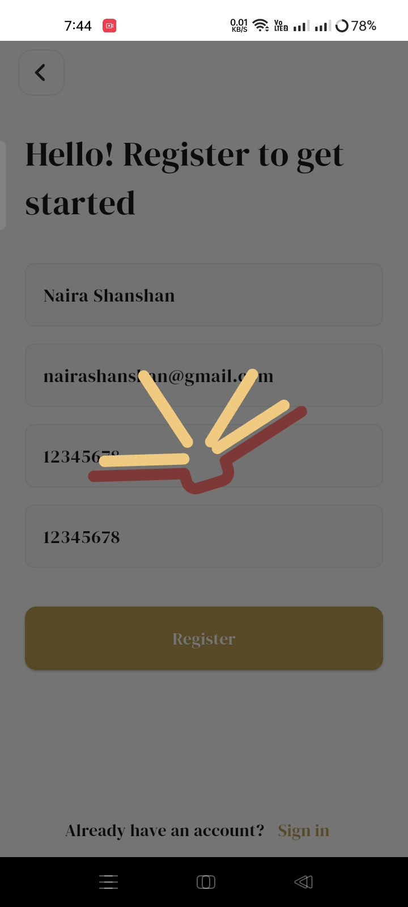
    </td>
  </tr>
</table>

---

### 🔐 Authentication
<table align="center">
  <tr>
    <td align="center">
      <b>Login</b> 
      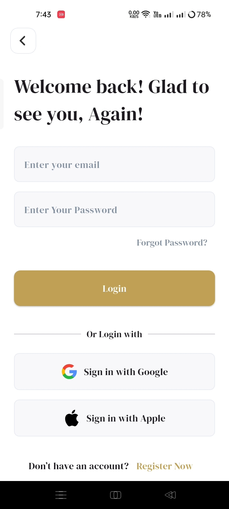
    </td>
    <td align="center">
      <b>Register</b> 
      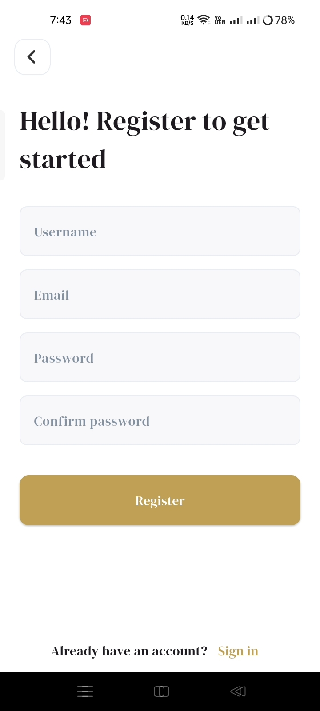
    </td>
  </tr>
</table>

---

### 🏠 Home
<table align="center">
  <tr>
    <td align="center">
      <b>Best Sellers</b> 
      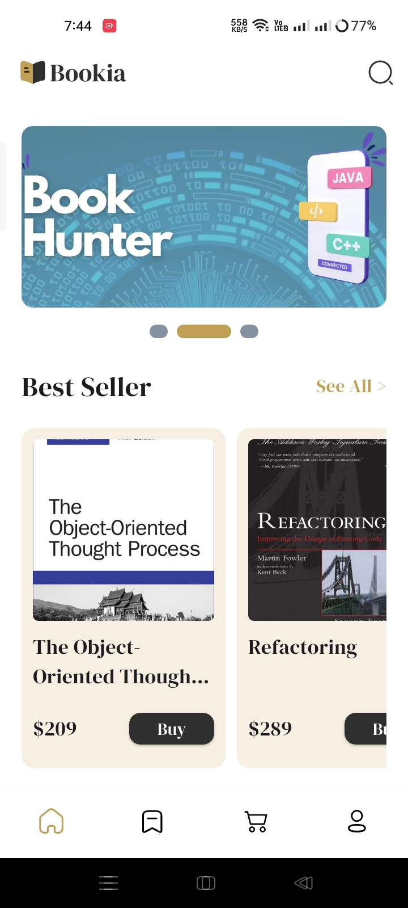
    </td>
    <td align="center">
      <b>New Arrivals</b> 
      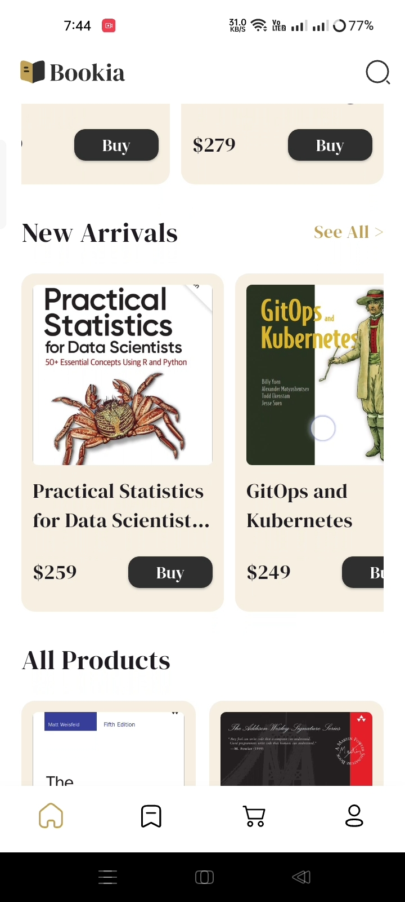
    </td>
    <td align="center">
      <b>All Products</b> 
      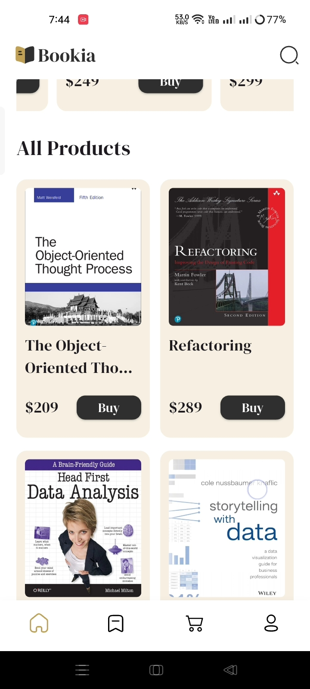
    </td>
  </tr>
</table>

---

### 🔍 Search
<table align="center">
  <tr>
    <td align="center">
      <b>Search Result 1</b> 
      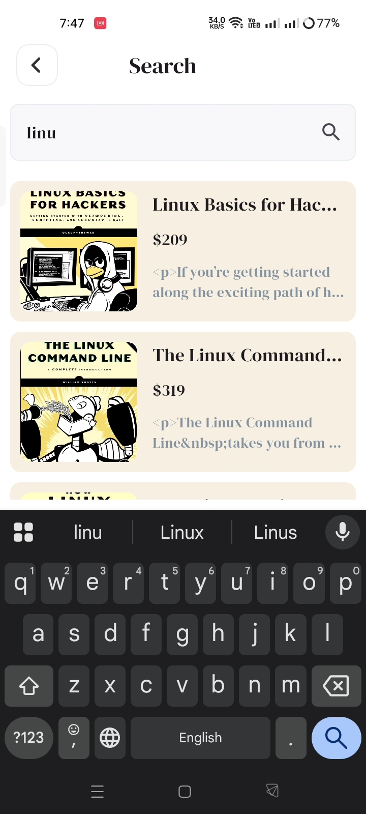
    </td>
    <td align="center">
      <b>Search Result 2</b> 
      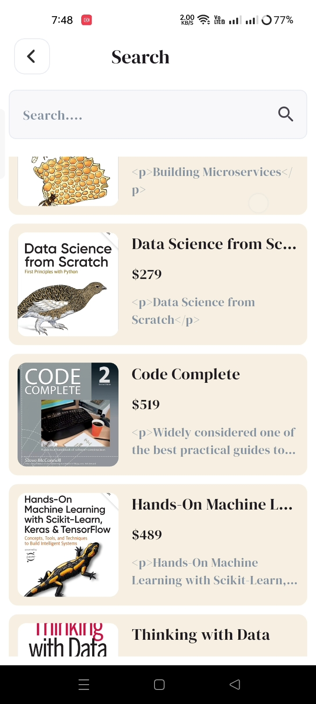
    </td>
    <td align="center">
      <b>Search Result 3</b> 
      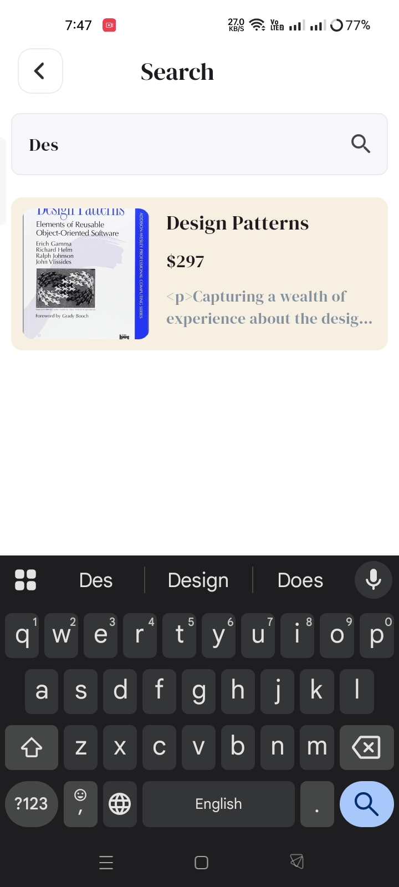
    </td>
  </tr>
</table>

---

### ❤️ Wishlist
<table align="center">
  <tr>
    <td align="center">
      <b>Wishlist</b> 
      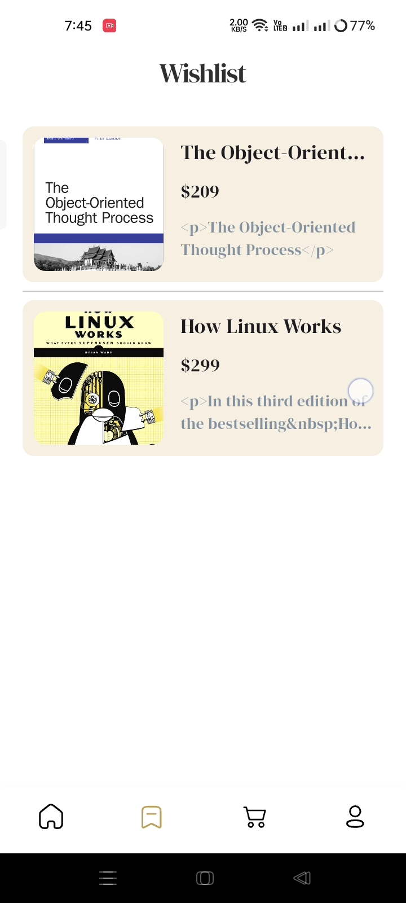
    </td>
    <td align="center">
      <b>Empty Wishlist</b> 
      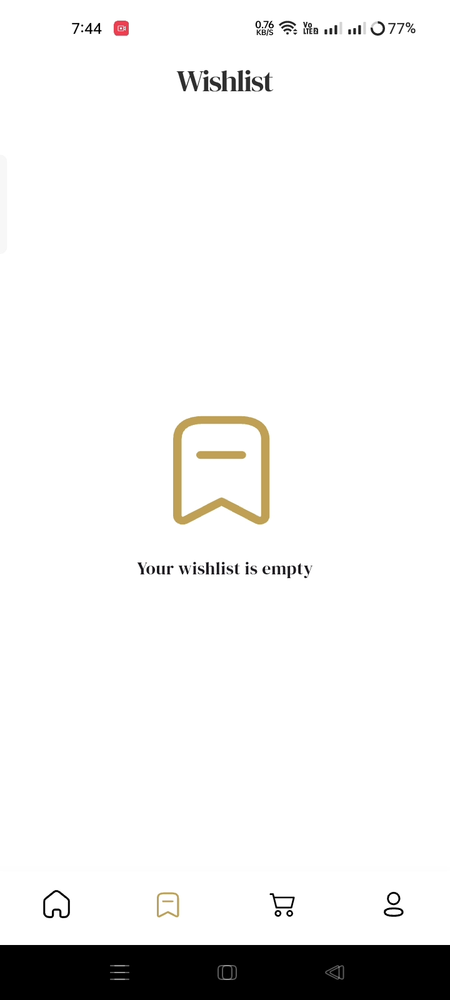
    </td>
  </tr>
</table>

---

### 🛒 Cart
<table align="center">
  <tr>
    <td align="center">
      <b>Cart</b> 
      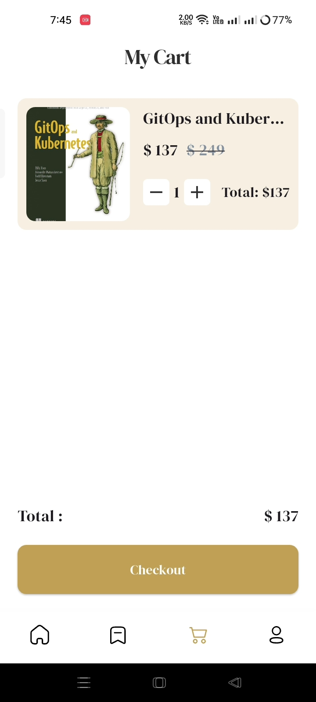
    </td>
    <td align="center">
      <b>Empty Cart</b> 
      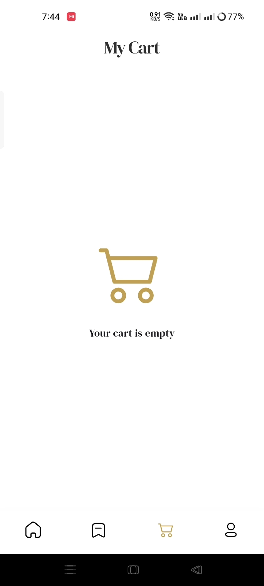
    </td>
  </tr>
</table>

---

### 📘 Book Details
<table align="center">
  <tr>
    <td align="center">
      <b>Book Details</b> 
      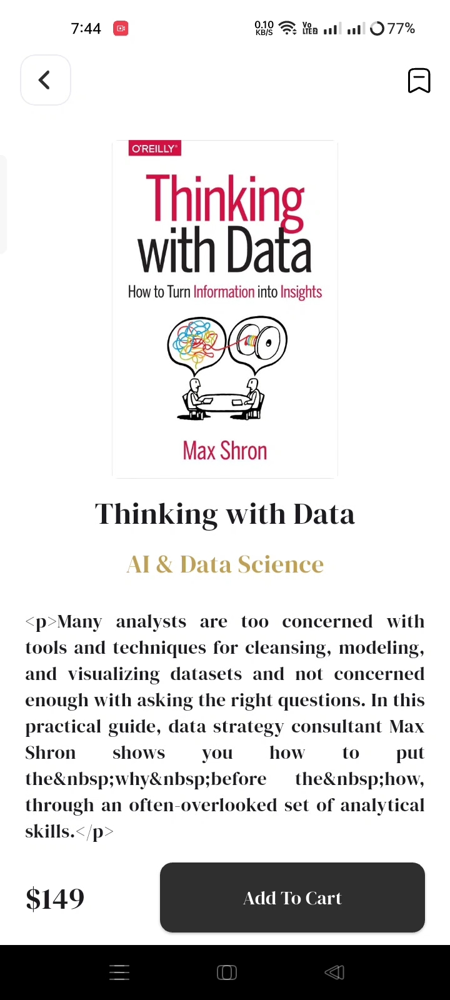
    </td>
  </tr>
</table>

---

### 👤 Profile & Settings
<table align="center">
  <tr>
    <td align="center">
      <b>Profile</b> 
      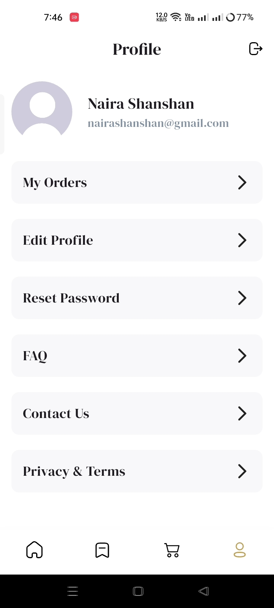
    </td>
    <td align="center">
      <b>Edit Profile</b> 
      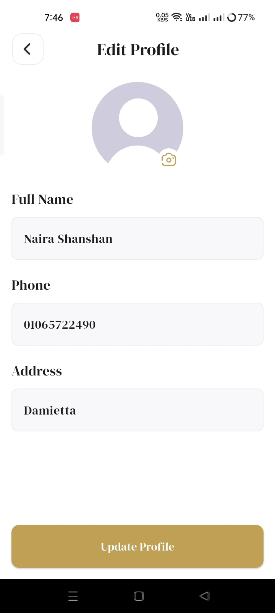
    </td>
    <td align="center">
      <b>Change Password</b> 
      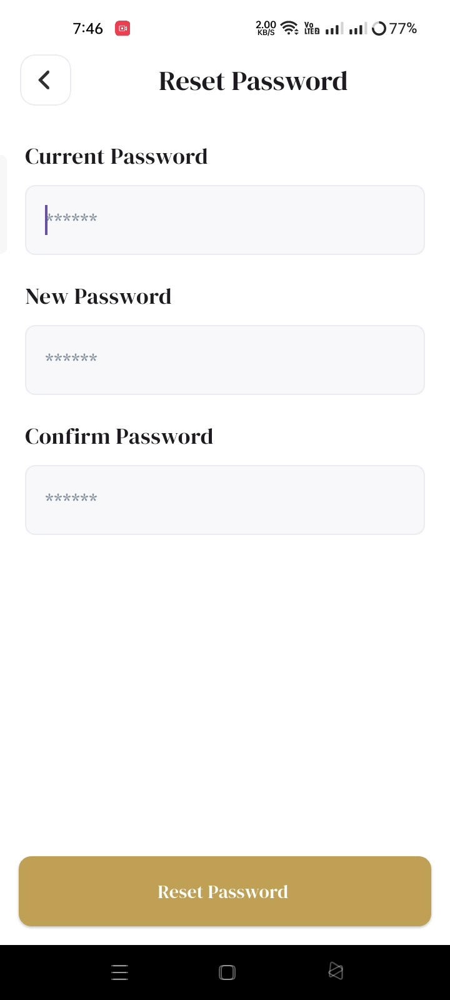
    </td>
  </tr>
  <tr>
    <td align="center">
      <b>Logout</b> 
      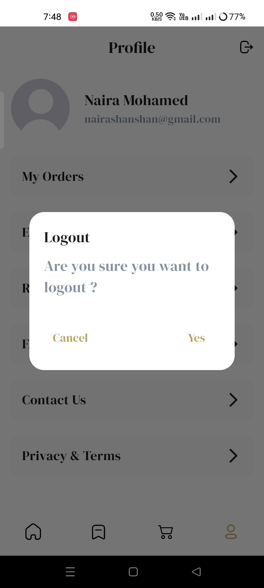
    </td>
  </tr>
</table>

---

### 📦 Orders Flow
<table align="center">
  <tr>
    <td align="center">
      <b>My Orders</b> 
      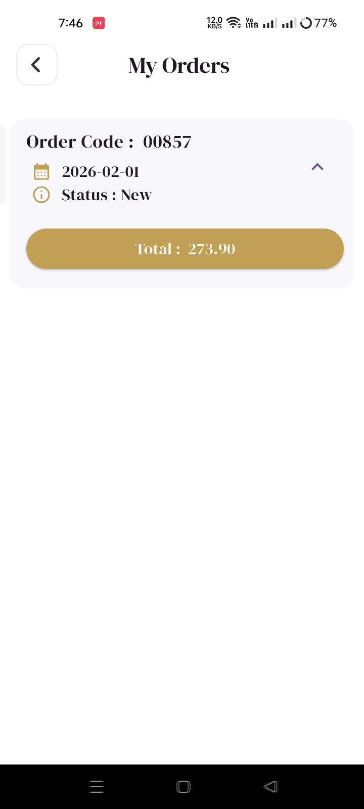
    </td>
    <td align="center">
      <b>Place Order</b> 
      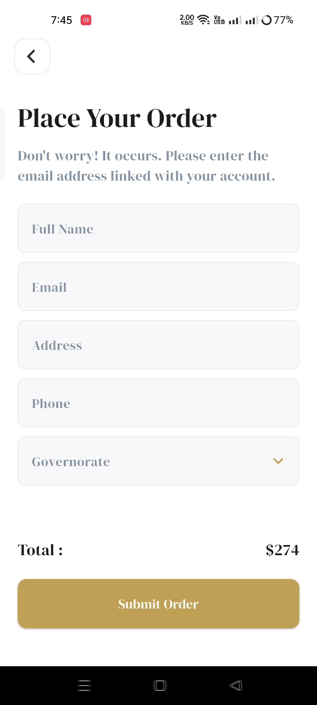
    </td>
    <td align="center">
      <b>Order Completed</b> 
      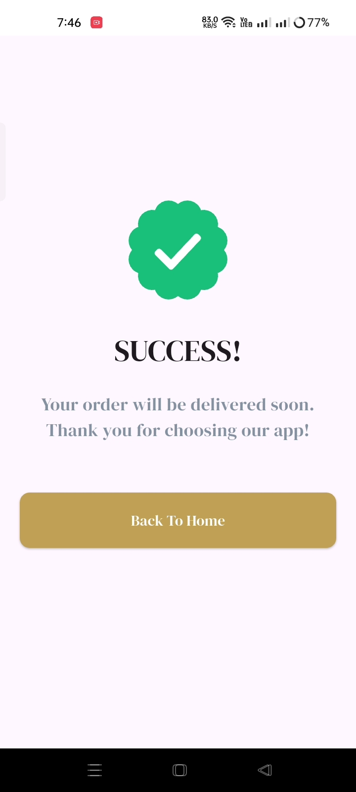
    </td>
  </tr>
</table>

---

### 🌍 Location
<table align="center">
  <tr>
    <td align="center">
      <b>Governorates</b> 
      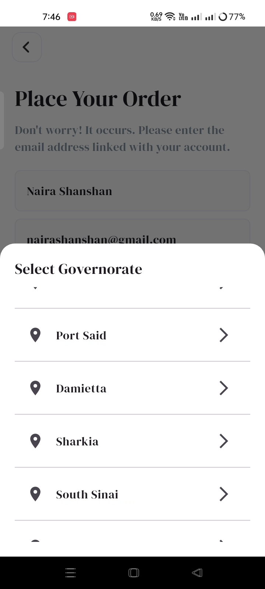
    </td>
  </tr>
</table>

